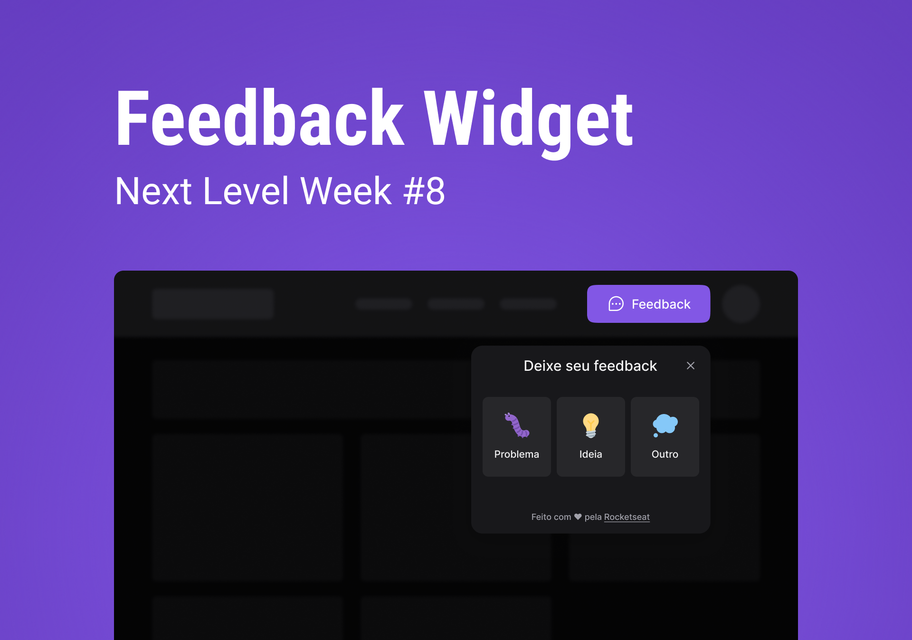

<div align="center">
   <h1>Feedback Widget</h1>
</div>
<div align="center">
   <a href="https://github.com/mathrb22">
      
   </a>
   
   
   <a aria-label="React Version" href="https://github.com/facebook/react/blob/main/CHANGELOG.md#1800-march-29-2022">
      </img>
   </a>
   <a href="https://github.com/mathrb22/feedback-widget/commits/main">
      
   </a>
   <a href="https://github.com/mathrb22/feedback-widget/issues">
      
   </a>
   <a href="https://github.com/mathrb22/feedback-widget/pulls">
      
   </a>
   <a href="https://github.com/mathrb22/feedback-widget/blob/main/LICENSE">
      
   </a>
   </br>
   </br>
   <a href="#-tecnologias-utilizadas">
      
      
      
   </a>
</div>

</br>
<div align="center">

[**Sobre**](#-sobre) &nbsp;&nbsp;**|**&nbsp;&nbsp;
[**Tecnologias e ferramentas utilizadas**](#-tecnologias-e-ferramentas-utilizadas) &nbsp;&nbsp;**|**&nbsp;&nbsp;
[**Layout**](#-layout) &nbsp;&nbsp;**|**&nbsp;&nbsp;
[**Instalação e execução**](#-instalação-e-execução) &nbsp;&nbsp;**|**&nbsp;&nbsp;
[**Como contribuir**](#-como-contribuir) &nbsp;&nbsp;**|**&nbsp;&nbsp;
[**Contato**](#-contato) &nbsp;&nbsp;**|**&nbsp;&nbsp;
[**Licença**](#-licença)

</div>

## 📃 Sobre

<div align="center">
  
</div>
<br/>

**Feedback Widget** é o projeto desenvolvido durante a **Next Level Week Return**, um evento online produzido pela [**Rocketseat**](https://github.com/Rocketseat) entre os dias 02/05 e 06/05 de 2022.

Trata-se de um componente (Widget) de envio de feedback que pode ser acionado por meio de um botão flutuante ou por qualquer outro elemento da aplicação.
Este, exibe ao usuário os tipos de feedback disponíveis, permitindo que ele envie uma mensagem descrevendo algum problema ou sugestão, além de também conseguir enviar uma captura de tela tirada automaticamente pelo componente.

https://user-images.githubusercontent.com/62413443/166862753-21ddd54a-2d7f-4242-bc04-2733d8b72a5e.mp4

## 🚀 Tecnologias e ferramentas utilizadas

Este projeto foi desenvolvido com as seguintes tecnologias e ferramentas:

- [**React**](https://reactjs.org/)

- [**TypeScript**](https://www.typescriptlang.org/)

- [**Tailwind CSS**](https://tailwindcss.com/)

- [**Headless UI**](https://headlessui.dev/)

- [**Vite**](https://vitejs.dev/)

- [**Visual Studio Code**](https://code.visualstudio.com/)

## 📟 Layout

O layout e protótipo do **Feedbak Widget** foi desenvolvido pela equipe da **Rocketseat** através da ferramenta online [**Figma**](https://www.figma.com), um software de prototipação voltado para **UI Design (design de interfaces de usuário)**.
Você pode acessar o layout através deste link: [**Feedback Widget**](https://www.figma.com/community/file/1102912516166573468/Feedback-Widget).

## 🔧 Instalação e execução

Para baixar o código-fonte do projeto em sua máquina, primeiramente terá que ter instalado o [**Git**](https://git-scm.com/).

Com o Git instalado, em seu terminal execute o seguinte comando:

```bash
git clone https://github.com/mathrb22/feedback-widget.git
```

Para instalar as dependências e executar o projeto terá que ter instalado em sua máquina o [**Node.js**](https://nodejs.org/en/), que vem acompanhado do NPM. Com ele instalado:

Instale as dependências do projeto:

```bash
npm install
```

Execute o projeto:

```bash
npm run dev
```

## 💡 Como contribuir

- Faça um **_fork_** desse repositório;
- Crie um **branch** para a sua feature: `git checkout -b minha-feature`;
- Faça um **commit** com suas alterações: `git commit -m 'feat: Minha nova feature'`;
- Faça um **push** para o seu branch: `git push origin minha-feature`;
- Faça um **pull request** com sua feature;

Pull requests são sempre bem-vindos. Em caso de dúvidas ou sugestões, crie uma _**issue**_ ou entre em contato comigo.

## 📲 Contato

Entre em contato comigo por e-mail ou pelo meu LinkedIn:

<a href="mailto:math.ribeiro.dev@gmail.com"></a>
<a href="https://www.linkedin.com/in/matheus-ribeiro-dev/"></a>

## 📝 Licença

<a href="https://github.com/mathrb22/feedback-widget/blob/main/LICENSE">
    
</a>

Esse projeto está sob a licença **MIT**. Veja o arquivo _**LICENSE**_ para mais detalhes.

---

<h5 align="center">
  &copy;2022 - <a href="https://github.com/mathrb22/">Matheus Ribeiro</a>
</h5>
